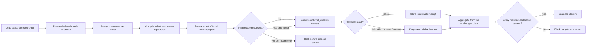

## Context

The current worktree contains two kinds of changes:

1. valuable generic supervision work: exact check ownership, immutable receipts, observation identity, evidence-domain separation, affected-only freshness, branch closure, transactional installation, TestMesh aggregation, and read-only receipt consumption;
2. an incorrect Guard-specific layer: purpose contracts, protected failures, semantic-obligation universes, native findings, and mandatory positive/shallow calibration applied to every maintained skill.

This design removes only the second category and retains the first. It extends the existing SkillGuard/OpenSpec/FlowGuard workflow rather than creating a replacement workflow.

## Goals / Non-Goals

**Goals**

- Give SkillGuard one fixed universal job: execute and reconcile the checks the target skill declares.
- Make missing, failed, skipped, timed-out, stale, duplicated, foreign, or unowned declared checks visible blockers.
- Preserve target-native ownership of routes, domain actions, judgments, models, oracles, and test meaning.
- Preserve exact execution, receipt, freshness, installation, branch, and consumer identity.
- Make target task-data freshness owner-scoped instead of binding every requested role to every owner.
- Keep reusable semantic identity independent of run/attempt identity.
- Fail compilation when any explicit selector is unresolved, and fail final admission before execution when the candidate is not actually frozen.
- Prove with a non-Guard fixture that no purpose statement or Guard-style counterexample is required.

**Non-goals**

- Deciding what PhysicsGuard, LogicGuard, SourceGuard, TraceGuard, WorldGuard, or FlowGuard should prevent.
- Interpreting a target's domain result.
- Requiring every skill to have good/bad pairs, semantic obligations, or a model universe.
- Adding a `core`, `guard`, `strict`, `advisory`, or other selectable purpose mode.

## Fixed Ownership Model

```text
Target skill owns:
  declared checks + commands + inputs + expected terminal results + domain meaning

SkillGuard owns:
  exact inventory + one execution owner + current execution + immutable receipts
  + freshness + visible gaps + installation/consumer projection + closure accounting
```

The target may declare any useful test family. SkillGuard treats each declaration uniformly. The absence of a Guard-style test category is not a mode and is not an error unless the target's own contract declares that category as required.

## Decisions

### 1. Declared-check inventory is the universal denominator

Every maintained target supplies one exact check manifest. Each required check has:

- `check_id` and `semantic_check_id`;
- exactly one `execution_owner_id`;
- command or native owner binding;
- exact functional inputs and dependencies;
- exact target-input role IDs consumed by the check, if any;
- covered target-declared obligation IDs;
- expected terminal result;
- evidence domain and immutable receipt location.

SkillGuard reconciles `declared = executed_terminal + visible_not_run`. A smaller caller-selected set cannot become complete evidence. Duplicate owner declarations, owner cycles, missing results, or a result for an undeclared check block closure. Several semantic checks may share one compiler-proven execution owner when their owner behavior, toolchain, inputs, target-input roles, and evidence domain are identical; the frozen plan retains every `check_id` and projection while the owner process runs only once.

`target_input_paths` means an explicitly universal task-data input consumed by every selected owner. `target_input_roles` is the owner-scoped form: each declared check names its exact `target_input_role_ids`, the compiler unions those roles only inside a shared execution owner, and the owner key includes only those selected role fingerprints. A missing declared role, an undeclared consumed role, or two checks sharing an owner while declaring different role sets blocks before execution. There is no inference from filenames and no fallback from a missing role to the universal input.

### 2. SkillGuard does not own target-domain purpose or findings

The following fields are removed from current SkillGuard authority:

- `purpose_contract_policy`
- `purpose_contract_identity`
- `protected_failure_claim_ids`
- `semantic_obligation_ids`
- `important_semantic_obligation_ids`
- `native_finding_identity`
- `semantic_obligation_results`
- `uncovered_semantic_obligation_ids`

Their schemas, runtime producers, prompt requirements, self-host fixtures, and tests are removed or rewritten. They may survive only as exact rejection fixtures when needed to prove the current schema rejects them.

Guard repositories may use similarly named domain-native concepts under their own schemas and namespaces. SkillGuard sees only the resulting declared check and receipt.

### 3. Request and observation identities remain generic and separate from attempts

The top-level `request_fingerprint` is restored. A run-local native contribution retains:

```text
target_skill_id
+ target_contract_hash / profile_hash
+ native_owner_id / native_route_id / native_check_id
+ run_id
+ target_obligation_ids
+ request_fingerprint
+ native_receipt_id / native_receipt_hash / native_receipt_artifact_ref
+ native_observation_locator
+ evidence_domain
```

`native_observation_locator` identifies target-owned observed material without claiming that SkillGuard understands its domain semantics. Numeric-only or mechanically renamed ranges remain invalid when the target declares content-addressed observation identity.

The run-local contribution may record `run_id`, but the reusable owner semantic key MUST NOT. The semantic key binds the normalized owner declaration, exact maintained input components, exact owner-scoped target-input fingerprints, semantic dependency receipts, command/toolchain, execution environment, evidence domain, and impact-policy identity. `run_id`, `step_id`, run-root path, timestamps, parent profile, aggregation identity, and output locations remain attempt/audit metadata.

Passing `{{run_root}}` to a trusted check provides its output location; it does not make the directory name or arbitrary run-local state a semantic input. A check that needs task data MUST receive it through the declared request fingerprint, universal target input, or owner-scoped target-input role. Undeclared run-root reads are a contract defect and cannot be legitimized by hashing `run_id`.

### 4. No universal positive/shallow calibration

SkillGuard no longer has a special mandatory calibration block. A target may declare checks named positive, negative, good, bad, replay, mutation, or any other category. Those checks are ordinary manifest members and follow the same execution/freshness rules.

SkillGuard's own regression tests include one synthetic failure: a required declared check is omitted, so supervision must fail. This proves SkillGuard's own behavior; it does not force every target to author the same fixture class.

### 5. Existing generic lifecycle protections remain

The following stay current:

- typed evidence domains where declared by the target;
- one immutable terminal success per exact execution identity;
- failed attempts never populate the reusable success slot;
- branch-conditional closure and verifier-owned applicability where the target declares branches;
- transactional whole-tree installation, rollback, and installed parity;
- affected-only invalidation from exact content-component edges;
- owner-scoped target-input invalidation from declared role edges;
- per-selector health that rejects each unresolved path or subtree independently;
- one final full validation owner after source/toolchain freeze;
- immutable TestMesh planning, public frozen-plan owner execution, aggregation, and read-only receipt consumption;
- exact shared-owner check projection: one owner receipt may cover several target-declared semantic projections only when the complete ordered `check_ids` and projection hashes remain frozen and aggregation-visible;
- truthful process-start accounting: a post-launch persistence error remains a failed owner attempt with `process_started=true` and a nonzero execution count;
- no background retry, scheduled task, or mutable-worktree full validation.

`depends_on_check_ids` means the downstream owner semantically consumes the upstream immutable receipt. It is not an execution-order hint. Order-only relationships stay in the FlowGuard development-process model or final aggregation and MUST NOT create freshness propagation.

OpenSpec task checkboxes, progress logs, reports, and receipts are evidence
outputs rather than governed source inputs. Their presentation state does not
enter owner or parent receipt freshness. Requirement/spec/design changes remain
governed inputs; marking an already-proved task complete cannot invalidate the
proof that licensed that mark.

### 6. Final admission is a pre-execution gate

`plan_only` MAY calculate an affected plan for a mutable development request, but a final/full plan MUST be rejected before any owner process starts unless all of the following are present and current:

- exact source and content-impact-plan fingerprints;
- exact check inventory, owner partition, selector health, and semantic dependencies;
- exact toolchain and execution-environment identities;
- every required universal and owner-scoped target input;
- a declared full-admission reason that is valid for the current changed components;
- a frozen candidate statement that is not contradicted by open mutable inputs.

Calling a request “final”, “frozen”, or `explicit_release_gate` is not evidence. Missing target inputs or an unfrozen plan produces a visible blocker and zero launched owners.

### 7. Field lifecycle disposition

Removed Guard-specific fields have disposition `delete_and_reject`. Generic replacements are:

| Removed field | Current generic owner |
|---|---|
| nested purpose request identity | top-level `request_fingerprint` |
| semantic locator naming | `native_observation_locator` |
| semantic results | target-declared check results |
| uncovered semantic obligations | missing target-declared obligation/check IDs |
| positive/shallow calibration authority | ordinary target-declared checks |

No alias, dual reader, fallback, or optional compatibility mode is allowed.

### 8. Public-export inventory is an owner-scoped semantic input

The privacy command scans the repository's exact current `git ls-files --cached --others --exclude-standard` candidate set. The self-host request projects that same normalized file set into one owner-scoped target-input role, `repository.public_export_candidates`, and only `owner:self:public-export-privacy` declares that role.

The role fingerprint binds both candidate membership and every candidate byte. A changed, added, or removed candidate therefore changes the privacy owner identity on the next frozen plan, while unrelated owners remain reusable unless their own declared components changed. The privacy scanner and the owner identity use the same candidate enumeration function; there is no second inventory, fallback scan, or compatibility reader.

The scanner rejects generic Windows absolute paths and common machine-local POSIX roots in addition to the explicitly sensitive current repository and home roots. Public evidence uses portable repository tokens rather than retaining historical machine paths.

### 9. A tag push verifies publication identity without repeating regression

The release commit is validated once by the normal branch-push CI suite. Test jobs explicitly exclude tag refs. A separate tag-only job verifies that the pushed tag is `v<VERSION>` and resolves to the checked-out commit; it contains no pytest or model command. This is one primary publication path, not a fallback: the version tag is created only after the exact release commit's branch CI succeeds.

## FlowGuard Model



Edges mean execution order, result consumption, or closure blocking. The model contains no branch that selects a Guard purpose mode.

## Migration Plan

1. Revise this existing OpenSpec change and verification contract.
2. Remove Guard-specific purpose/calibration fields from SkillGuard source authority and runtime.
3. Rewrite the native-depth FlowGuard child model as declared-check supervision.
4. Regenerate the self-contract and check manifest.
5. Replace purpose tests with generic supervision and retired-field rejection tests.
6. Run focused compiler, schema, model, and ordinary-skill regressions.
7. Transactionally install and verify the canonical SkillGuard tree.
8. Repair owner-scoped target-input identity, semantic attempt separation, per-selector health, and final-admission preflight.
9. Prove the affected-only matrix with focused compiler, check-runner, TestMesh, and FlowGuard regressions.
10. Backpropagate the privacy model miss into the owner-scoped candidate role, generic absolute-path regression, and release-workflow policy check.
11. Freeze inputs, reuse every exact successful owner receipt, execute only genuinely affected or new owners, and let OpenSpec consume the resulting parent receipt.

## Risks

- **Intertwined unfinished work:** generic and purpose-specific changes share files. Mitigation: remove fields and branches surgically; never reset the dirty worktree.
- **Old generated contracts remain stale:** regeneration is mandatory after source correction.
- **Guard repositories temporarily depend on SkillGuard purpose APIs:** migrate PhysicsGuard to its native owner before deleting the final installed projection; other Guard repositories are upgraded in the fixed sequence.
- **Shared target-input fingerprints over-invalidate owners:** compile exact role-to-owner edges and reject ambiguous shared-owner role sets.
- **Run-root readers hide undeclared inputs:** treat the run root as output location only; require every task-data input through current declared request or target-input authority.
- **Privacy execution sees more files than its receipt identity:** derive the request role and command scan from the same exact Git candidate enumeration and bind the complete membership/content fingerprint only to the privacy owner.
- **Tag creation repeats already-passed regression:** make branch CI the single regression gate and keep the tag workflow receipt-only.
- **Selector union hides missing authority:** validate every selector independently and block before owner planning.

## Open Questions

None. The user fixed the ownership and no-mode decisions.
